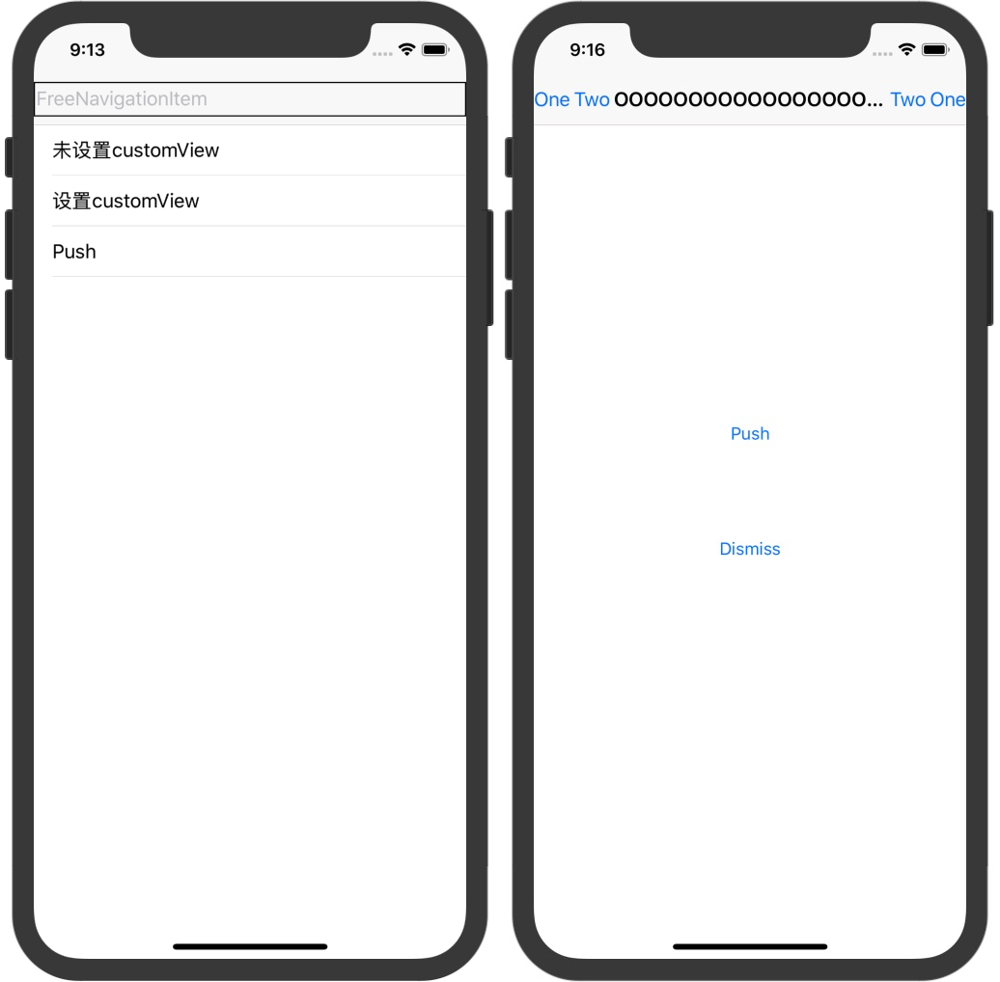

# 特性

1. 支持自定义返回图片和屏幕边缘的间距
2. 支持自定义`leftBarButtonItems`和返回按钮的间距
3. 支持自定义`leftBarButtonItems`、`rightBarButtonItems`和屏幕边缘的间距
4. 支持自定义`leftBarButtonItems`、`rightBarButtonItems`各个 Item 的间距
5. 支持自定义`titleView`和`leftBarButtonItems`、`rightBarButtonItems`的间距
6. 支持屏幕旋转

# 环境要求

- iOS 11.0+
- Swift 4.2

# 安装

## Cocoapods

在`Podfile`添加:

```
pod 'FreeNavigationItem'
```

# 使用

## 开启功能

```swift
UINavigationBar.freeNavigationItems()
```

然后设置相应属性。

## 全局设置

```swift
// UINavigationBar 的相应属性只能全局设置
UINavigationBar.backImageMargin = 0
UINavigationBar.backButtonWidth = 30

UINavigationItem.leftItemsMargin = 0
UINavigationItem.leftItemsSpacing = 0
UINavigationItem.minTitleContentViewMargin = 0
UINavigationItem.rightItemsMargin = 0
UINavigationItem.rightItemsSpacing = 0
UINavigationItem.firstLeftItemToBackSpacing = 0
```

## 单个页面指定设置

```swift
navigationItem.leftItemsMargin = 10
navigationItem.leftItemsSpacing = 2
navigationItem.minTitleContentViewMargin = 4
navigationItem.rightItemsMargin = 5
navigationItem.rightItemsSpacing = 3
navigationItem.firstLeftItemToBackSpacing = 1
```

